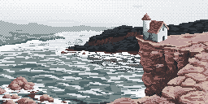

+++
date = '2026-07-21'
draft = false
title = 'Is Opacity Ok?'
slug = 'opacity'
+++

This is my latest attempt at pixel art. I do like it. I originally used opacity which feels kind of like cheating, but it looked great. However I couldn't make Aesprite export with the opacity so I redid it with dithering, which feels more proper.

