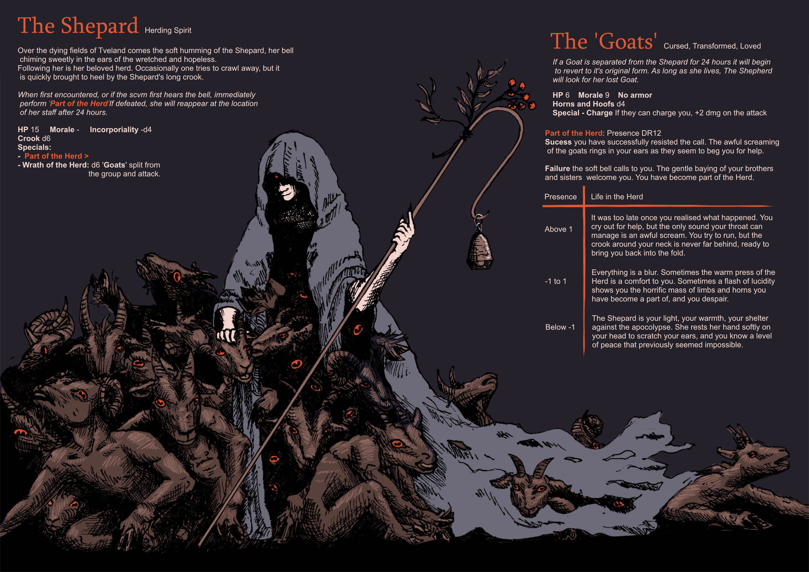
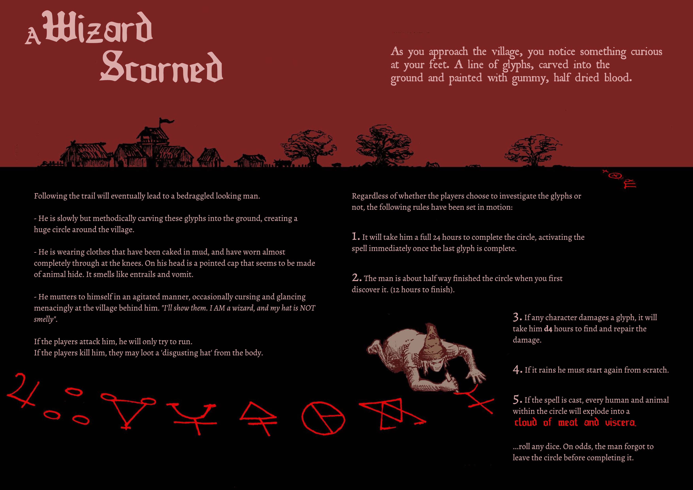

+++
date = '2026-10-09T21:26:52+01:00'
draft = true
title = 'Morktober Part 1'
tags = ['PRJ-morktober']
+++

Morktober started last week (because, you know, October). Theoretically I'm on track because I have *plans* for all of the entries that hasve passed. However in terms of actual finished enries that exist we're talking like, 2.5/9. Obviously that's not ideal, but I think I want to comboine a few of the more beach/nautical themed ones into a mini-campaign, and sometimes it's easier to do those in batches.

What I'm saying makes sense I swear.

Any way here's days 1 and 3... more to come (I hope)

